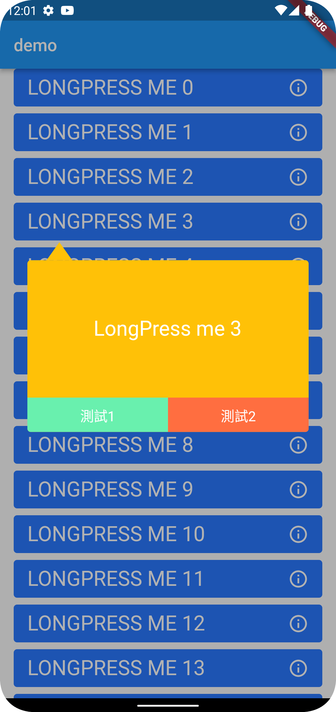
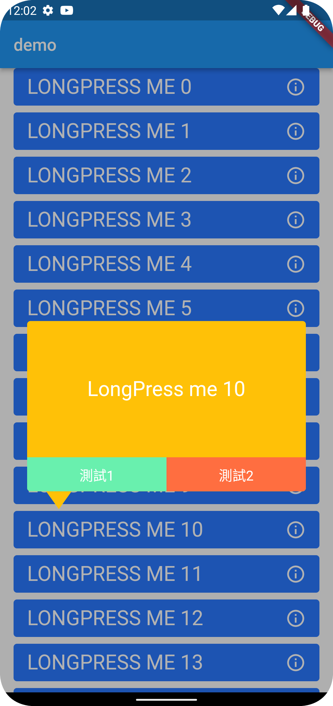

# CustomPopupMenu-Flutter

### How to do that

``` dart
GlobalKey actionKey = LabeledGlobalKey(title);

//add a global key to the view where you want to display the menu
void _cell() {
  return GestureDetector(
    key: actionKey,
    child: CustomView,
  );
}

// use golbal key to get the position
void _findPosition() {
  RenderBox? renderBox =
      actionKey.currentContext?.findRenderObject() as RenderBox?;
  if (renderBox != null) {
    height = renderBox.size.height;
    width = renderBox.size.width;
    Offset offset = renderBox.localToGlobal(Offset.zero);
    xPosition = offset.dx;
    yPosition = offset.dy;
  }
}

// add the view to the screen
void addMenuToScreen() {
  Widdet floatingMenuView = _OverlayEntry(
    builder: (context) {
      return Positioned(
          left: xPosition,
          top: yPosition + height,
          width: width,
          child: CustomMenu());
    },
  );

  // add to screen
  Overlay.of(context)?.insert(floatingMenuView);

  // remove from screen
  //floatingMenuView?.remove();
}
```

### Screenshot



